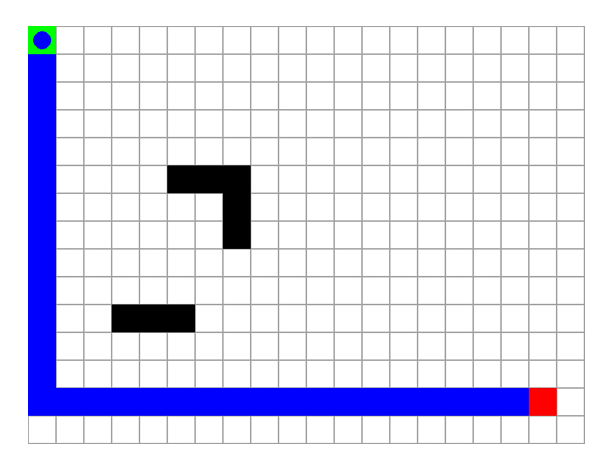
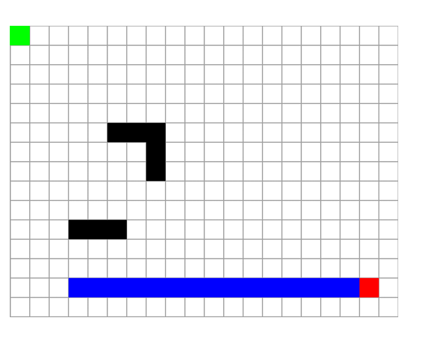
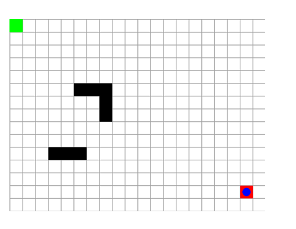

# AI-Autonomous Vehicle & Robotics (Grid-Based Path-Finding Demo)

## 🧠 Overview
A lightweight Python/Pygame project that demonstrates **A\*** path-planning for an autonomous robot on a 2-D grid.  
The robot (blue circle) starts at **S** (green cell), navigates around obstacles (black) along the shortest path (blue trail), and arrives at **G** (red cell).

---

## 📁 Project Tree
```
│  ai_autonomous_vehicle.py   # main script
│  map.csv                    # sample grid dataset
│   grid_initial.png        # empty grid + obstacles
│   pathfinding.png         # path overlay
│   final_state.png         # robot reaches goal
```

---

## ⚙️ Requirements
* Python 3.8 +
* [`pygame`](https://www.pygame.org/)  
  ```bash
  pip install pygame
  ```

---

## ▶️ Running the Demo
1. **Clone / download** the repo contents.  
2. Ensure **`ai_autonomous_vehicle.py`** and **`map.csv`** sit in the same directory.  
3. Run:
   ```bash
   python ai_autonomous_vehicle.py
   ```
4. A Pygame window opens and the robot gradually follows the planned path (5 FPS for visibility).  
   Close the window to exit.

---

## 🗺️ Customising the Map
Open **`map.csv`**—each cell is comma-separated:

| Symbol | Meaning        |
|--------|----------------|
| `0`    | Free space     |
| `1`    | Obstacle       |
| `S`    | Start position |
| `G`    | Goal position  |

Make sure there is exactly *one* `S` and `G`.

---

## 🖼️ Output Screenshots  

| Initial Grid | Path Planning | Final State |
|:------------:|:-------------:|:-----------:|
|  |  |  |

You can save screenshots with:

```python
pygame.image.save(screen, "output/grid_initial.png")
```

---

## 🧩 How It Works
1. **CSV Loader** → Builds `grid`, identifies `start` and `goal`.  
2. **A\* Search** (`heapq` priority queue) finds the shortest path avoiding obstacles.  
3. **Main Loop** → Renders grid, path, and animates the robot one node per tick.  

---

## 🚀 Extending the Project
* Add dynamic/moving obstacles
* Implement LiDAR-like sensors
* Add GUI control for map editing
* Use real-world path planning models

---


